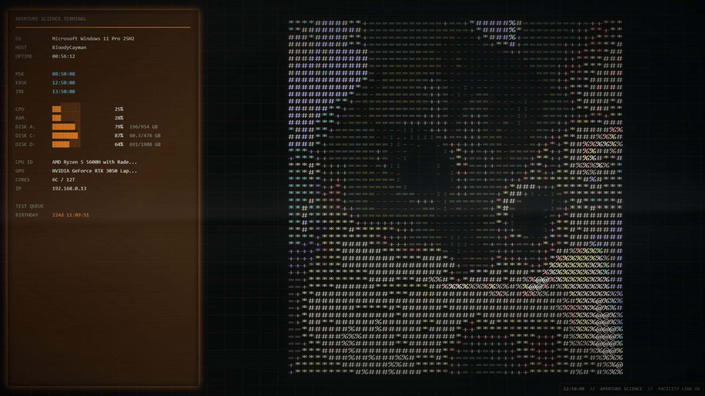
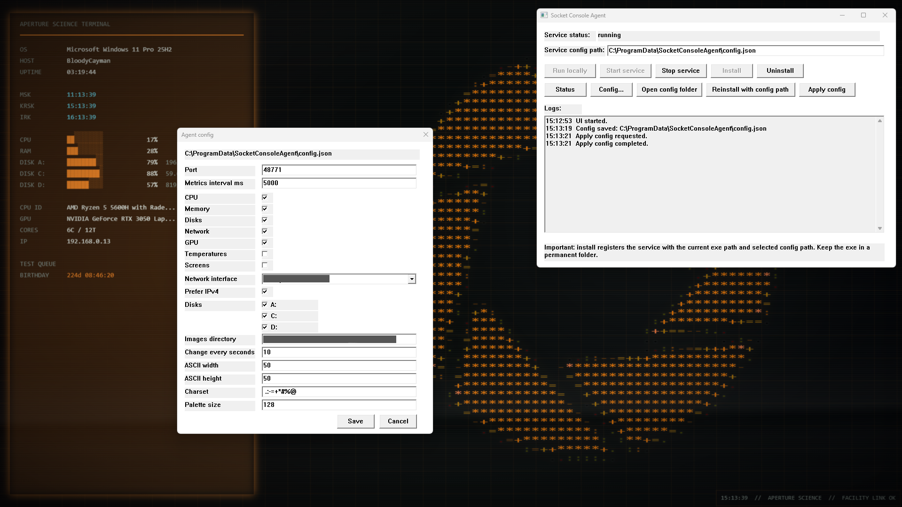

# Socket Console Wallpaper

Интерактивные терминальные Web-обои для Wallpaper Engine. Live metrics требуют опциональный локальный companion agent. Обои также работают как самостоятельная NO SIGNAL терминальная сцена с цветной ASCII-стилистикой, таймерами, дополнительными UTC-часами, темами и CRT/VHS-эффектами.

English documentation: [README.md](README.md)

## Примечание о разработке

Проект разработан при поддержке AI-ассистента Codex GPT-5.5 High.

## Превью




## Безопасность и прозрачность

Для бинарного файла опционального локального агента доступен публичный [отчёт VirusTotal](https://www.virustotal.com/gui/file-analysis/ZWZlZjFkZTQxY2I5ODBkYTVkMTYxZTBiZmE3MzdlNzk6MTc3OTc3Mzc5MA==). На момент проверки 70 из 71 антивирусных движков не пометили `socket-console-agent.exe`; один движок показал generic suspicious detection.

Весь исходный код открыт в этом репозитории. Ревью, issues и фидбек по любому участку реализации приветствуются.

## Агент

Локальный Windows-агент находится в `agent/`.

```powershell
cd .\agent
go build -o socket-console-agent.exe .
.\socket-console-agent.exe run
```

Для release-сборки, которая открывает UI по двойному клику без консольного окна:

```powershell
go build -ldflags="-H windowsgui" -o socket-console-agent.exe .
```

### CLI-команды

> **Очень важно:** `socket-console-agent.exe install` регистрирует Windows Service с путём к тому exe-файлу, из которого запущена команда. Установщик не копирует exe в другую папку. Сначала переместите `socket-console-agent.exe` в постоянное место, например `C:\Program Files\Socket Console Agent\socket-console-agent.exe`, и только потом запускайте `install` оттуда. После установки не удаляйте и не перемещайте этот exe, иначе служба не сможет запуститься.

| Команда | Описание |
| --- | --- |
| `socket-console-agent.exe ui` | Открывает native Windows-панель управления. Запуск exe без аргументов в интерактивной desktop-сессии открывает тот же UI. |
| `socket-console-agent.exe run` | Запускает агент в текущей консоли для разработки и тестирования. Читает `.\config.json`, создаёт его при отсутствии, слушает только `127.0.0.1` и корректно завершается по `Ctrl+C`. |
| `socket-console-agent.exe install` | Устанавливает агент как Windows Service с автоматическим запуском. Запускать из терминала с правами администратора. |
| `socket-console-agent.exe uninstall` | Удаляет регистрацию Windows Service. Если служба запущена, сначала остановите её. Запускать из терминала с правами администратора. |
| `socket-console-agent.exe start` | Запускает установленную Windows Service. Служба должна быть предварительно установлена. |
| `socket-console-agent.exe stop` | Останавливает установленную Windows Service. |
| `socket-console-agent.exe status` | Показывает текущий статус Windows Service: `running`, `stopped` или `unknown (<code>)`. |
| `socket-console-agent.exe help` | Показывает общую справку CLI. |
| `socket-console-agent.exe help <command>` | Показывает подробную справку по конкретной команде, например `socket-console-agent.exe help run`. |
| `socket-console-agent.exe run --help` | Показывает справку команды через альтернативный синтаксис help-флага. |

### Endpoints агента

Endpoints по умолчанию для разработки:

```text
GET  http://127.0.0.1:48771/api/v1/status
GET  http://127.0.0.1:48771/api/v1/config
POST http://127.0.0.1:48771/api/v1/config
GET  http://127.0.0.1:48771/api/v1/interfaces
GET  http://127.0.0.1:48771/api/v1/disks
GET  http://127.0.0.1:48771/api/v1/images
GET  http://127.0.0.1:48771/api/v1/ascii
WS   ws://127.0.0.1:48771/api/v1/live
```

Пути конфигурации:

```text
Режим разработки:  .\config.json
Режим службы:      %ProgramData%\SocketConsoleAgent\config.json
Установка из UI:   выбранный в панели путь передается службе как service --config <path>
Переопределение:   SOCKET_CONSOLE_AGENT_CONFIG=C:\path\to\config.json
```

## Обои

Web-проект для Wallpaper Engine находится в `wallpaper/`.

Локальный предпросмотр в браузере:

```powershell
cd .\wallpaper
python -m http.server 48880 --bind 127.0.0.1
```

Затем откройте:

```text
http://127.0.0.1:48880/index.html
```

Настройки Wallpaper Engine:

- `theme`: `dark`, `light` или `aperture`
- `useAgent`: включает подключение к опциональному локальному агенту для live metrics
- `agentDownloadUrl`: ссылка на последний релиз опционального локального агента
- `crtEffect`: базовые CRT scanlines, glow, flicker и vignette
- `vhsWaveEffect`: волна старого VHS/CRT-монитора
- `showCpu`, `showRam`, `showGpu`, `showTemperatures`, `showCores`, `showIp`, `showNet`, `showScreen`, `showDisk`
- `showDiskFreeSpace`: показывает свободно/всего GB рядом с процентами дисков
- `asciiOffsetX`, `asciiOffsetY`
- `timer1Title` ... `timer5Title`
- `timer1Target` ... `timer5Target`
- `clock1Title` ... `clock3Title`
- `clock1Offset` ... `clock3Offset`

Примеры значений для таймеров:

```text
2026-12-31 23:59
31.12.2026 23:59
31.12
31.12 23:59
```

Примеры смещений UTC для часов:

```text
+7
-4
+5:30
```
